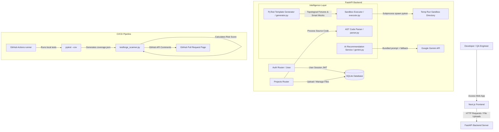

# TestForge AI - Comprehensive Interview Preparation & Codebase Walkthrough

This document is your master reference manual to prepare for technical interviews and project defenses. It maps every component of TestForge AI using details directly from your active codebase.

---

## 1. Actual Technology Stack

### Frontend (Client-side Console)
*   **Next.js 16.2.6** (React 19 framework) configured with Turbopack for asset compilation.
*   **React 19.2.4 & ReactDOM 19.2.4** (Core component architecture).
*   **TailwindCSS v4** (Utility-first styling engine with customized PostCSS).
*   **TypeScript 5.x** (Strict compilation and statically-typed templates).
*   **Recharts v3.8.1** (Interactive SVG graphing library for metrics).
*   **Lucide React v1.17.0** (Vector iconography).

### Backend (Web Server & Intelligence Engine)
*   **FastAPI** (High-performance ASGI API framework).
*   **Uvicorn** (ASGI server wrapper).
*   **Pydantic** (JSON request/response serialization and schema enforcement).
*   **SQLAlchemy** (SQL Declarative ORM mapper).
*   **python-jose** (JWT token signing & cryptographic validation).
*   **passlib[bcrypt]** (Password hashing operations).
*   **python-multipart** (Form-data multipart parser).

### AI Engine & Integrations
*   **Google Generative AI Python SDK** (`google-generativeai`): Connects to `gemini-2.5-pro` (primary) and `gemini-2.5-flash` (fallback).

### Testing & Verification Pipeline
*   **pytest** (Core testing harness).
*   **pytest-cov** (Statement line coverage reporter, outputs `coverage.json`).
*   **pytest-asyncio** (Coroutines execution support).

### Scripts & DevOps Orchestration
*   **Python `ast` library**: Core AST node compiler and code crawler.
*   **urllib.request & urllib.parse**: Zero-dependency networking for CI comments.
*   **Git / Git CLI**: Git-diff line analysis and repository log history checks.

### Environment & Database Config
*   **SQLite**: File-based SQL storage engine.
*   **python-dotenv**: Loads variables from `.env`.

---

## 2. Complete Project Architecture

The TestForge AI architecture follows a decoupled client-server pattern. The frontend handles console presentation, while the backend hosts the intelligence and execution layers:



---

## 3. Important Folders and Files

### Backend (`/backend`)
*   [main.py](file:///C:/Users/Chirag%20Vasava/Downloads/Personal/Final%20Projects/TestForge/backend/app/main.py): Sets up the FastAPI app, whitelists CORS domains, and mounts routes under the `/api` prefix.
*   [database.py](file:///C:/Users/Chirag%20Vasava/Downloads/Personal/Final%20Projects/TestForge/backend/app/database.py): Configures SQLAlchemy engine, session pools (`SessionLocal`), and registers the `get_db` dependency.
*   [models.py](file:///C:/Users/Chirag%20Vasava/Downloads/Personal/Final%20Projects/TestForge/backend/app/models.py): Defines the database schema tables.
*   [schemas.py](file:///C:/Users/Chirag%20Vasava/Downloads/Personal/Final%20Projects/TestForge/backend/app/schemas.py): Houses Pydantic schemas validating user, file, and test run payloads.
*   [parser.py](file:///C:/Users/Chirag%20Vasava/Downloads/Personal/Final%20Projects/TestForge/backend/app/parser.py): Compiles python source files into AST structures to extract class bases, decorators, returns, and exceptions.
*   [generator.py](file:///C:/Users/Chirag%20Vasava/Downloads/Personal/Final%20Projects/TestForge/backend/app/generator.py): Translates AST metadata structures into syntactically valid pytest files.
*   [executor.py](file:///C:/Users/Chirag%20Vasava/Downloads/Personal/Final%20Projects/TestForge/backend/app/executor.py): Handles sandbox script creations and runs pytest subprocesses.
*   [gemini.py](file:///C:/Users/Chirag%20Vasava/Downloads/Personal/Final%20Projects/TestForge/backend/app/gemini.py): Handles interaction with the Google Generative AI API, implementing fallbacks and output cleaning.
*   `routers/`: Splitted feature endpoints:
    *   [auth.py](file:///C:/Users/Chirag%20Vasava/Downloads/Personal/Final%20Projects/TestForge/backend/app/routers/auth.py): Handles user registration, JWT logins, and current user retrieval.
    *   [projects.py](file:///C:/Users/Chirag%20Vasava/Downloads/Personal/Final%20Projects/TestForge/backend/app/routers/projects.py): Handles uploading files and project workspaces.
    *   [tests.py](file:///C:/Users/Chirag%20Vasava/Downloads/Personal/Final%20Projects/TestForge/backend/app/routers/tests.py): Orchestrates template generation, file saving, and test execution.
    *   [ai.py](file:///C:/Users/Chirag%20Vasava/Downloads/Personal/Final%20Projects/TestForge/backend/app/routers/ai.py): Recommends edge cases for classes or functions.

### Frontend (`/frontend`)
*   [src/lib/api.ts](file:///C:/Users/Chirag%20Vasava/Downloads/Personal/Final%20Projects/TestForge/frontend/src/lib/api.ts): Central API client handling authentication header injection and global 401 logouts.
*   [src/app/projects/\[id\]/page.tsx](file:///C:/Users/Chirag%20Vasava/Downloads/Personal/Final%20Projects/TestForge/frontend/src/app/projects/%5Bid%5D/page.tsx): Main console interface containing file sidebars, source code views, recommendation cards, and test execution outputs.

### CI/CD & Scripts (`/`)
*   [scripts/testforge_scanner.py](file:///C:/Users/Chirag%20Vasava/Downloads/Personal/Final%20Projects/TestForge/scripts/testforge_scanner.py): Standalone CLI scanner calculating AST complexity, git diff risks, and posting PR comments.
*   [.github/workflows/testforge_ci.yml](file:///C:/Users/Chirag%20Vasava/Downloads/Personal/Final%20Projects/TestForge/.github/workflows/testforge_ci.yml): Enforces quality gates by executing the scanner CLI on commit.

---

## 4. Major Application Modules

1.  **Auth & Session Manager**: Issues signed JWT access tokens when users register or verify credentials.
2.  **Project Registry & Workspace File Manager**: Receives code files via multipart forms, saving them to SQLite.
3.  **AST Parser Module**: Evaluates Python syntax trees without executing code, outputting class/method nodes, annotations, exception raises, and return expressions.
4.  **PyTest Generator Engine**: Computes class dependencies, creates topologically ordered fixture signatures, generates mocks, asserts return types, and outputs valid test files.
5.  **Isolated Execution Sandbox**: Spawns isolated subprocess tasks that execute pytest and coverage modules, reading execution logs.
6.  **AI recommendation & Fallback Service**: Connects to the Gemini API, falling back to Flash if Pro limits are reached, and post-processes outputs to remove duplicate declarations.
7.  **CI/CD Scanner CLI**: Run on local machines or GitHub Actions to calculate risk indexes and post comments to pull requests.

---

## 5. End-to-End Data Flow

Here is how data travels when a developer requests a test suite run:

1.  **Upload**: The frontend client selects and uploads multiple source files. They are stored in SQLite (`project_files` table).
2.  **AST Parsing**: Clicking "Generate Base PyTest" fires a request to `/api/tests/{project_id}/generate`. The backend compiles a registry of all classes in the project, extracts properties, and passes them to the generator.
3.  **PyTest Code Assembly**: The generator computes fixture dependencies, formats mocks, constructs assertions, and returns the assembled template to the client browser.
4.  **AI Enhancements**: Users click "Recommend Edge Cases". The backend queries Gemini with the AST metadata, cleans code redefinitions, and displays recommended test functions.
5.  **Saving**: Appending recommendations automatically updates the editor. Clicking "Save" calls `/api/tests/{project_id}/save`, storing it in SQLite (`generated_tests` table).
6.  **Sandboxed Execution**: Clicking "Execute" sends a POST request to `/api/tests/{project_id}/run`. The backend writes all files to a unique temporary directory, spawns `pytest --cov`, parses execution states, updates `test_runs` in the database, and returns log data to the browser charts.

---

## 6. AI Integration Points

*   **Endpoint `/api/ai/recommend`**: Accepts a target file name, class name, and code block.
*   **Prompt Construction**: Dynamically bundles the class/method AST structure into a system instruction context.
*   **Dynamic Fallback Logic**: Checks for `429 Too Many Requests` API quota limits. If hit, it transparently downgrades from `gemini-2.5-pro` to `gemini-2.5-flash` to maintain functionality.
*   **Post-processing Cleansing**: The backend parses the AI response and removes any top-level class redefinitions (e.g. `class Book:`) that would duplicate imported types and crash compilation.

---

## 7. Testing Architecture

*   **Sandboxing**: Runs in a generated unique directory path `backend/temp_runs/{run_uuid}/` to isolate files.
*   **Subprocess Execution**: The backend runs python test collections using Python's `subprocess` API:
    ```bash
    python -m pytest --cov=. --cov-report=json:coverage.json
    ```
*   **Logs Retrieval**: Parses command return codes, stdout prints, and parses `coverage.json` to extract statement totals, coverage percentages, and missing code lines.

---

## 8. QA Automation Architecture

*   **Specification Conversion**: QA engineers input manual specifications (e.g. "Create regular member, borrow book, check status"). TestForge uses Gemini to translate these actions into structured automated Playwright scripts.
*   **Externalized Test Data**: Mocks parameter datasets (e.g. test credentials, book titles) into decoupled configurations, separating test logic from data variables.

---

## 9. Database Architecture

SQLite manages relational structures with SQLite's default ACID transactions:

*   `users`: Stores `email` (unique index) and `hashed_password` (hashed with bcrypt).
*   `projects`: Links projects to user owners via `owner_id` (foreign key pointing to `users.id`).
*   `project_files`: Links source code uploads to parent projects.
*   `generated_tests`: Stores the current pytest files.
*   `test_runs`: Tracks pass counts, fail counts, coverage percentages, and console stdout outputs.

---

## 10. Deployment Architecture

*   **Frontend**: Deployed to **Vercel** (`testforge-ai-lime.vercel.app`).
*   **CORS Configuration**: Restricts origin requests; whitelists your Vercel address to ensure browser security allows API communication.

---

## 11. Security Architecture

*   **Password Hashing**: Employs password hashing using `passlib[bcrypt]` with custom salt configurations.
*   **Session tokens (JWT)**: Cryptographically signed token payloads using HMAC SHA-256 (`HS256` algorithm).
*   **Static AST Parsing**: Extracts properties using code syntax compilation, preventing execution of malicious uploads.
*   **CORS Origin Restrictions**: Whitelists specific domains to block cross-origin requests.

---

## 12. Top 30 Things You Must Understand for the Interview

1.  What an **Abstract Syntax Tree (AST)** is and how Python's native `ast` library works.
2.  Why **static analysis (AST)** is safer than dynamic imports (`importlib`) when parsing code.
3.  How **Topological Sort** resolve fixture dependencies.
4.  Why we use **pytest fixtures** and how they handle dependency injection.
5.  How FastAPI handles **asynchronous requests (`async`/`await`)**.
6.  The difference between **concurrency** (async event loops) and **parallelism** (multi-processing).
7.  How **JWT authentication** works (cryptographic signatures, header verification).
8.  Why **bcrypt** is used for password hashing and how salting protects against rainbow tables.
9.  How **SQLAlchemy ORM** abstracts SQL queries and helps prevent SQL Injection attacks.
10. The role of **FastAPI CORSMiddleware** and how CORS preflight options checks function.
11. How the **isolated subprocess execution sandbox** in `executor.py` operates.
12. Why **pytest-cov** is run with JSON output flags to calculate code coverage.
13. How `testforge_scanner.py` calculates **Cyclomatic Complexity** using AST branches.
14. What **Code Churn / Modification Frequency** is and why it correlates with software bugs.
15. The custom **Risk Score Algorithm** weighting formula.
16. How **dynamic model fallback** works in AI recommenders.
17. Why **post-process code sanitization** is necessary to prevent duplicate class definition errors.
18. How browser automation differs from unit testing (e.g. **Playwright vs. PyTest**).
19. What **strict TypeScript typing** resolves in Next.js builds.
20. Why **externalizing test data** from scripts is a best practice.
21. What the **GitHub Pull Request Comments API** is and how comment deduplication works.
22. How **sqlite3** manages concurrency limitations (file-level lock locks).
23. The difference between **unit tests**, **integration tests**, and **E2E tests**.
24. How `@property` decorator methods are accessed without parentheses.
25. What happens when a method returns `None` and how assertions check this.
26. How exception raises are tested using `pytest.raises()`.
27. Why Next.js page generation uses **App Router** server vs client components.
28. What **CI/CD quality gates** are and how they prevent broken merges.
29. How token context size limits affect LLM inputs.
30. How to explain that you built this project **using AI as a pair-programmer** while maintaining full code ownership.

---

## 13. Top 30 Questions an Interviewer Is Likely to Ask

1.  "What was the most challenging technical problem you solved on this project?"
2.  "How does your backend safely execute user-uploaded python test code?"
3.  "Why did you choose SQLite over PostgreSQL for this application?"
4.  "What is an Abstract Syntax Tree (AST), and how did you use it?"
5.  "Explain how your system resolves fixture dependencies."
6.  "What happens if two users upload files at the same time? How does SQLite handle concurrency?"
7.  "How does JWT token verification work? Where is the signature validated?"
8.  "Why did you use FastAPI instead of Django or Flask?"
9.  "How does your GitHub Actions workflow comment on Pull Requests without posting duplicate messages?"
10. "What is Cyclomatic Complexity, and how did you calculate it?"
11. "Explain your Risk Score formula. Why does code churn affect risk?"
12. "What happens if the Gemini API rate limit is reached? How does your system handle it?"
13. "Why does the backend need to clean duplicate class declarations from Gemini's response?"
14. "What is the difference between `@property` and regular methods? How does your generator test them?"
15. "How do you verify if a dataclass field was initialized in `__post_init__` versus standard construction?"
16. "Explain the difference between OAuth2 and JWT. How are they combined in your routers?"
17. "What is CORS, and why did you have to configure it when deploying to Vercel?"
18. "If this app scales to 1 million users, what are the first bottlenecks you expect to hit?"
19. "How would you migrate this project to use PostgreSQL? What changes are required?"
20. "Why did you use Next.js instead of vanilla React?"
21. "What is the difference between client components and server components in Next.js?"
22. "How does Playwright interact with the browser? Why choose it over Selenium?"
23. "Why is it important to test negative paths? How does your system extract `raise` statements?"
24. "How does `python-multipart` parse incoming file uploads?"
25. "Explain how SQLAlchemy session lifecycle management works via `db.close()`."
26. "How did using AI to assist in coding help you, and how did you ensure you understood the code?"
27. "What is a coverage gap? Why is line-level coverage more useful than file-level coverage?"
28. "If a test run hangs or takes too long in the sandbox, how does your executor prevent a server crash?"
29. "Where are environment variables stored, and how does python-dotenv load them?"
30. "What is one feature you would add next to make TestForge AI production-ready?"

---

## 14. Topics You Currently Appear Weakest In (Based on Codebase)

1.  **Concurrency Scaling**: Understanding how to use background queues (like Celery/Redis) rather than blocking python subprocess executions on FastAPI endpoints.
2.  **Mocking Frameworks**: Explaining how to mock active databases or third-party API dependencies inside the pytest sandbox.
3.  **Authentication Protocols**: Explaining the exact mechanics of JWT signatures and key rotation.
4.  **Database Concurrency & Locking**: Explaining SQLite's database-level write locks versus PostgreSQL's row-level locks.

---

## 15. Recommended Learning Order

1.  **Core Architecture & AST Engine** (Phases 1, 5, 6)
2.  **Python Concepts & Database Layer** (Phases 2, 4)
3.  **FastAPI, Next.js & REST Communication** (Phases 3, 11)
4.  **PyTest, Coverage & Playwright Testing** (Phases 8, 9, 10)
5.  **AI recommendation & Fallback Logic** (Phase 7)
6.  **Security, Scalability & Production Architectures** (Phases 12, 17, 18, 19)
7.  **System Design, Mock Interviews & Vibe Coding Defense** (Phases 16, 21)