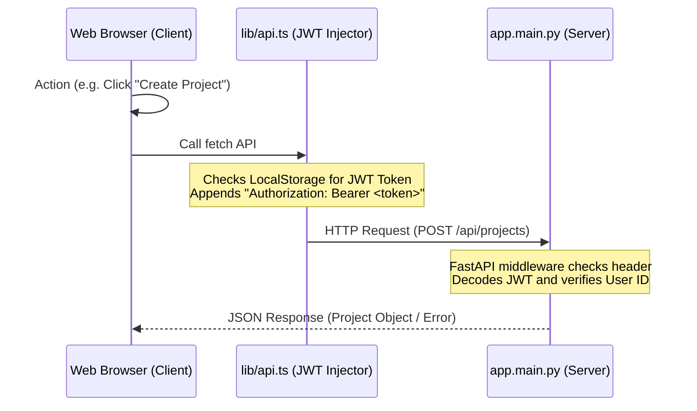
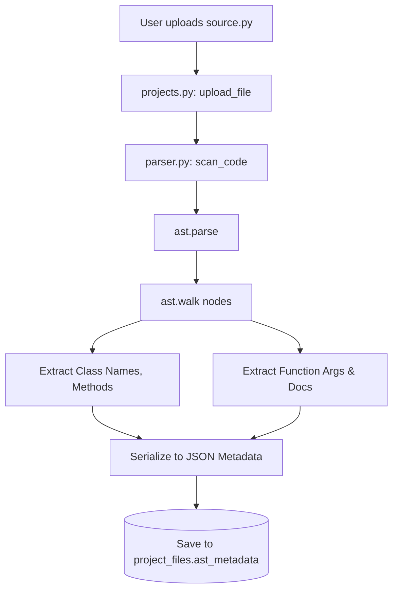
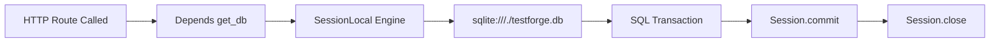
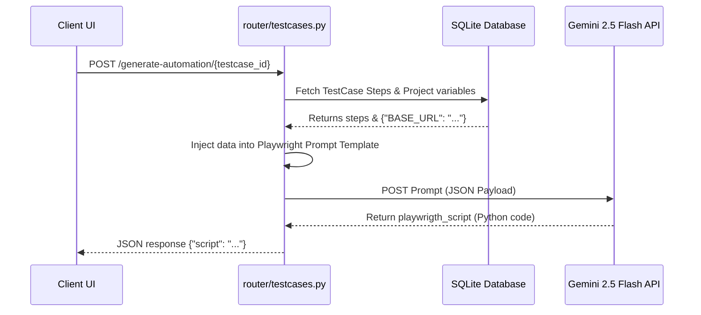
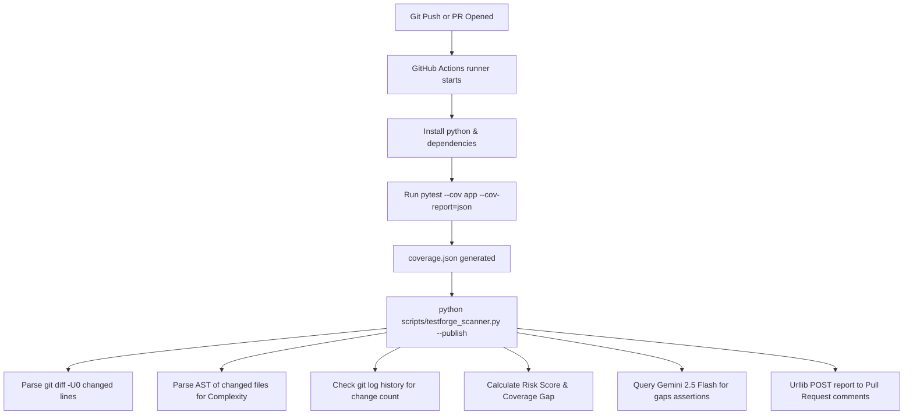
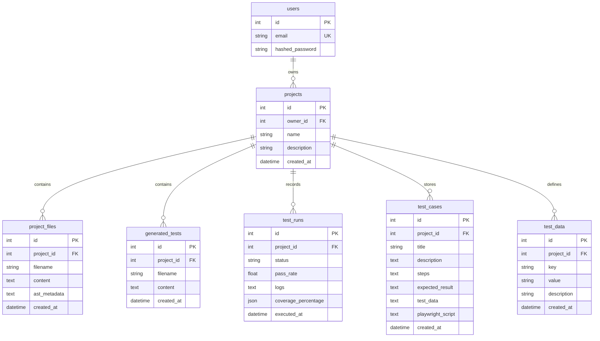

# TestForge AI - Comprehensive Project Architecture & Deep Dive Guide

This document provides a highly detailed, technical blueprint of **TestForge AI** to help you master the codebase, database relationships, API endpoints, business logic flows, and DevOps pipeline architectures for your upcoming placements.

---

## 1. Complete Tech Stack

TestForge AI is structured as a modern multi-tier web application decoupled into a micro-frontend layer, a high-performance backend server, a relational SQLite data engine, and an automated DevOps reporting runner.

### Frontend
- **Core Framework:** **Next.js (v16.2.6)** utilizing the App Router model for file-system-based page routing, static site optimization, and Server Components (SSR).
- **Language:** **TypeScript (v5)** with strict mode enabling static type validation, compile-time error checking, and structural interfaces.
- **Styling:** **Tailwind CSS (v4)** for compiling utility-first responsive structures, custom animations, glassmorphic dark-mode aesthetics, and consistent layouts.
- **Iconography:** **Lucide React** for standardized web interface icons.
- **Data Visualizations:** **Recharts** for plotting code coverage, test run statuses, and change risk indicators dynamically in the user workspace.

### Backend
- **Core Framework:** **FastAPI** async ASGI framework for python REST API services, built on top of Starlette and Pydantic.
- **Server:** **Uvicorn** for fast ASGI application execution.
- **Config Management:** **python-dotenv** to securely load environment configurations.
- **Data Parsers:** Python standard library **`ast`** for safe structural source scanning without running code.

### Database
- **Engine:** **SQLite (v3)** — serverless, file-based relational database.
- **ORM Interface:** **SQLAlchemy** for query building, relational mappings, and connection pooling.
- **Data Serialization:** **Pydantic** validation schemas for strict JSON object verification.

### Authentication
- **Encryption:** **Passlib** with the `bcrypt` hashing algorithm for secure password hashing.
- **Token System:** **Python-jose** for signing and verifying JSON Web Tokens (JWT) using `HS256`.

### AI Integrations
- **SDK:** **Google Generative AI (google-generativeai)** Python library.
- **Model:** **Gemini 2.5 Flash** for rapid, cost-effective inference.
- **Use Cases:**
  - Automated Playwright browser automation code generation from manual test steps.
  - Ast-targeted function boundary and edge case assertion generation.

### DevOps & CI/CD
- **Pipeline Orchestrator:** **GitHub Actions** running automated workflows.
- **Orchestration Tool:** Standalone python Scanner CLI script (`scripts/testforge_scanner.py`) executing AST scanning, complexity checking, and git log audits.
- **PR Comment API Engine:** Standard library `urllib` HTTP agent with anti-spam check.

### Testing Libraries
- **Execution:** **PyTest** test runner.
- **Coverage Metering:** **Coverage.py** (`pytest-cov`) for generating line-level code statements, covered lists, and missing execution paths.
- **Async Execution:** **pytest-asyncio** for running asynchronous tests cleanly.

---

## 2. High-Level Architecture

TestForge AI consists of 5 integrated runtime streams.

### A. Frontend HTTP Request/Response Flow


### B. Backend AST Parsing Flow


### C. Database Connection Flow


### D. AI Script Generation Flow


### E. CI/CD Pipeline Quality Gate Flow


---

## 3. Complete Folder Structure

```
TestForge/
├── .github/                         # GitHub Actions workflows directory
│   └── workflows/
│       └── testforge_ci.yml         # CI/CD Quality Gate Pipeline configuration
│
├── backend/                         # FastAPI Python Backend
│   ├── app/                         # Core Application package
│   │   ├── routers/                 # Endpoint controller modules
│   │   │   ├── ai.py                # Gemini edge-case suggestions endpoints
│   │   │   ├── auth.py              # JWT authentication & register routes
│   │   │   ├── projects.py          # Workspaces & python source uploads
│   │   │   ├── testcases.py         # CSV spreadsheets, Variables, & Playwright
│   │   │   └── tests.py             # PyTest sandbox executor & reports
│   │   ├── auth.py                  # Cryptographic password hashing & token validation
│   │   ├── database.py              # SQLite session connection provider
│   │   ├── executor.py              # PyTest subprocess runner & JSON mapper
│   │   ├── gemini.py                # Client connection to Google Generative AI
│   │   ├── generator.py             # AST PyTest template builder
│   │   ├── models.py                # SQLAlchemy DB entities definition
│   │   ├── parser.py                # AST code structures analyzer
│   │   ├── schemas.py               # Pydantic JSON input/output validators
│   │   └── main.py                  # Server app initiation & CORS configs
│   ├── .env                         # Backend variables (ignored)
│   ├── check_db.py                  # Relational database CLI inspection helper
│   ├── requirements.txt             # Backend dependencies lists
│   └── testforge.db                 # SQLite local database binary (ignored)
│
├── frontend/                        # Next.js App Router Frontend
│   ├── src/
│   │   ├── app/                     # File-system routing hierarchy
│   │   │   ├── login/               # Sign-in UI page
│   │   │   ├── register/            # Sign-up UI page
│   │   │   ├── projects/
│   │   │   │   └── [id]/            # Unified testing & QA workspace
│   │   │   │       └── runs/
│   │   │   │           └── [run_id]/ # Sandbox execution coverage reporter page
│   │   │   ├── page.tsx             # Projects dashboards homepage
│   │   │   ├── layout.tsx           # Global container and typography font imports
│   │   │   └── globals.css          # CSS styles & custom Tailwind utilities
│   │   └── lib/
│   │       └── api.ts               # Fetch client with automated JWT request headers
│   ├── .env.local                   # Frontend variables (REACT_EDITOR configuration)
│   ├── package.json                 # Next.js dependencies list & Webpack dev configurations
│   └── tsconfig.json                # TypeScript project settings
│
├── scripts/
│   └── testforge_scanner.py         # Standalone Quality Intelligence Scanner CLI
│
└── bank_account.py                  # Sample Python file for project verification
```

### Folder Purposes
*   **`.github/workflows`**: Houses the automated quality pipelines executed by GitHub runner VMs.
*   **`backend/app/routers`**: Decouples API handlers based on their business domain (Auth, Projects, Tests, AI, TestCases).
*   **`backend/temp_runs`**: Used as a local, temporary directory to write uploaded source code and executing `pytest` commands.
*   **`frontend/src/app`**: Implements the user interface using React components, handling views for authentication, workspaces, and test reports.
*   **`scripts`**: Contains the Scanner engine, isolated from web server runtimes so it can run inside standard command-line environments.

---

## 4. Database Schema

The database is built on relational SQLite tables mapped via SQLAlchemy in `backend/app/models.py`.



### Tables & Relationships
1.  **`users`**: Manages credentials.
    - `id` (INT, PK), `email` (VARCHAR, Unique, Indexed), `hashed_password` (VARCHAR).
    - Relationship: One-to-Many with `projects`.
2.  **`projects`**: Grouping workspace for code analysis.
    - `id` (INT, PK), `owner_id` (INT, FK -> `users.id`), `name` (VARCHAR), `description` (TEXT), `created_at` (DATETIME).
    - Relationship: One-to-Many with `project_files`, `generated_tests`, `test_runs`, `test_cases`, and `test_data`.
3.  **`project_files`**: Stores AST metadata and raw content of python code uploads.
    - `id` (INT, PK), `project_id` (INT, FK -> `projects.id`), `filename` (VARCHAR), `content` (TEXT), `ast_metadata` (TEXT/JSON), `created_at` (DATETIME).
4.  **`generated_tests`**: Stores generated PyTest files.
    - `id` (INT, PK), `project_id` (INT, FK -> `projects.id`), `filename` (VARCHAR), `content` (TEXT), `created_at` (DATETIME).
5.  **`test_runs`**: Logs test executions.
    - `id` (INT, PK), `project_id` (INT, FK -> `projects.id`), `status` (VARCHAR), `pass_rate` (FLOAT), `logs` (TEXT), `coverage_percentage` (FLOAT), `executed_at` (DATETIME).
6.  **`test_cases`**: Stores QA specifications.
    - `id` (INT, PK), `project_id` (INT, FK -> `projects.id`), `title` (VARCHAR), `description` (TEXT), `steps` (TEXT), `expected_result` (TEXT), `test_data` (TEXT), `playwright_script` (TEXT), `created_at` (DATETIME).
7.  **`test_data`**: Stores environment-specific parameters.
    - `id` (INT, PK), `project_id` (INT, FK -> `projects.id`), `key` (VARCHAR), `value` (VARCHAR), `description` (VARCHAR), `created_at` (DATETIME).

---

## 5. Backend APIs

Here is the exact request/response mapping for all core API routes (prefixed with `/api`).

### A. Auth Router (`/api/auth`)

#### `POST /api/auth/register`
- **Purpose:** Create a new user profile.
- **Request Body (JSON):**
  ```json
  {
    "email": "user@example.com",
    "password": "strongpassword"
  }
  ```
- **Response (201 Created):**
  ```json
  {
    "id": 1,
    "email": "user@example.com"
  }
  ```

#### `POST /api/auth/login`
- **Purpose:** Standard OAuth2 form-based login.
- **Request Body (Form URL-Encoded):**
  - `username`: "user@example.com"
  - `password`: "strongpassword"
- **Response (200 OK):**
  ```json
  {
    "access_token": "JWT_TOKEN_STRING",
    "token_type": "bearer"
  }
  ```

#### `POST /api/auth/login/json`
- **Purpose:** JSON payload login (used by the frontend API client).
- **Request Body (JSON):**
  ```json
  {
    "email": "user@example.com",
    "password": "strongpassword"
  }
  ```
- **Response (200 OK):** Same as standard login.

#### `GET /api/auth/me`
- **Purpose:** Read logged-in user profile.
- **Headers:** `Authorization: Bearer <token>`
- **Response (200 OK):**
  ```json
  {
    "id": 1,
    "email": "user@example.com"
  }
  ```

---

### B. Projects Router (`/api/projects`)

#### `POST /api/projects/`
- **Purpose:** Create a new project.
- **Request Body (JSON):**
  ```json
  {
    "name": "Project Name",
    "description": "Optional details"
  }
  ```
- **Response (200 OK):** Project details including ID and user mapping.

#### `GET /api/projects/`
- **Purpose:** List all projects owned by the user.
- **Response (200 OK):** Array of Project objects.

#### `POST /api/projects/{project_id}/upload`
- **Purpose:** Upload a Python file to a project (triggers parser scan).
- **Request Form Multi-part:** `file` (Binary binary file)
- **Response (200 OK):**
  ```json
  {
    "message": "File uploaded and parsed successfully",
    "file_id": 3
  }
  ```

---

### C. Tests Router (`/api/tests`)

#### `GET /api/tests/{project_id}/generate`
- **Purpose:** Create PyTest template code via AST nodes.
- **Response (200 OK):**
  ```json
  {
    "filename": "test_bank_account.py",
    "content": "import pytest\n# AST auto-generated tests..."
  }
  ```

#### `POST /api/tests/{project_id}/run`
- **Purpose:** Run PyTest inside the sandbox environment.
- **Response (200 OK):**
  ```json
  {
    "id": 12,
    "status": "passed",
    "pass_rate": 1.0,
    "logs": "============================= test session starts =============================...",
    "coverage_percentage": 94.2
  }
  ```

---

### D. AI Router (`/api/ai`)

#### `POST /api/ai/recommend`
- **Purpose:** Get Gemini recommendations for a selected class or function.
- **Request Body (JSON):**
  ```json
  {
    "file_id": 3,
    "name": "BankAccount",
    "element_type": "class"
  }
  ```
- **Response (200 OK):**
  ```json
  {
    "suggestions": [
      {
        "title": "Negative Deposit",
        "explanation": "Verify deposit raises ValueError on negative numbers.",
        "test_code": "def test_deposit_negative():\n    with pytest.raises(ValueError):\n        ..."
      }
    ]
  }
  ```

---

### E. TestCases Router (`/api/testcases`)

#### `POST /api/testcases/{project_id}/generate-automation/{testcase_id}`
- **Purpose:** Translate QA steps and variables into a Playwright script.
- **Response (200 OK):**
  ```json
  {
    "script": "from playwright.sync_api import sync_playwright...\n"
  }
  ```

---

## 6. Authentication Flow

Authentication secures the application via state-free JWT tokens, hashed passwords, and middleware route locks.

```
1. REGISTER:
User Input ───> Password hashed via bcrypt ───> Stored in SQLite users table

2. LOGIN:
Credentials ───> Bcrypt password match check ───> Generate JWT token with sub (User ID)

3. API CALL:
Client HTTP requests ───> Header includes "Bearer <JWT>" ───> Router Decodes JWT ───> Resolves User ID
```

### Flow Details:
*   **Password Hashing:** `passlib.context.CryptContext(schemes=["bcrypt"])` hashes password strings with a cryptographically secure salt. Original password text is never stored.
*   **JWT Generation (`auth.py`):** Encodes user identity (`sub`) and expiration time (`exp`) into a signed base64 string using the `SECRET_KEY` and the `HS256` HMAC algorithm.
*   **Request Interceptor (`frontend/src/lib/api.ts`):** Client-side fetch wrapper parses API calls. If a JWT token exists in the browser's storage, it appends the header:
    `Authorization: Bearer <token>`
*   **Dependency Injection Gate (`auth.get_current_user`):** Decodes the incoming header JWT token. If the signature is invalid or expired, it immediately returns `HTTP 401 Unauthorized`. If valid, it returns the verified `User` model, which routers use to query database items.

---

## 7. AI Features

TestForge AI leverages **Gemini 2.5 Flash** for two distinct generative tasks.

### Feature A: Boundary Edge Case Generator (`backend/app/routers/ai.py` $\rightarrow$ `gemini.py`)
*   **Purpose:** Scan AST code nodes and write pytest unit tests.
*   **Input Context:** Raw source code of the file, target function/class name, and element type.
*   **Prompt Structure:**
    ```
    You are an expert QA and test automation engineer.
    Analyze the following Python source code and generate 3 to 5 critical edge cases for the {element_type} named `{name}`.
    Think about extreme inputs, empty inputs, type mismatches, exception triggers, and boundary conditions.
    
    For each edge case, provide:
    1. A title describing the edge case.
    2. A detailed explanation of why it is an edge case and how to test it.
    3. The exact python test code using `pytest` to verify this case.
    
    Your entire response MUST be a valid JSON object matching the following structure:
    {
        "suggestions": [
            {
                "title": "...",
                "explanation": "...",
                "test_code": "..."
            }
        ]
    }
    ```
*   **Output Handling:** Strips potential Markdown code fences (e.g. ` ```json `) returned by the AI, parses the raw JSON body, and serves it to the frontend code editor injection module.

### Feature B: Playwright Browser Automation (`backend/app/routers/testcases.py`)
*   **Purpose:** Generate e2e browser tests from manual steps, parameterizing the script with stored variables.
*   **Input Context:** Test case title, description, manual steps, expected result, and a JSON block of all project variables (e.g., `{"BASE_URL": "http://localhost:3000"}`).
*   **Prompt Structure:**
    ```
    You are an expert QA and test automation engineer.
    Convert the following manual test case into a working, high-quality Playwright Python script.
    
    Test Case Details:
    - Title: {title}
    - Steps: {steps}
    - Expected Result: {expected_result}
    
    Externalized Test Data Context (inject these variables):
    {data_context}
    
    Your response must be the raw python code using the playwright sync or async API.
    Follow these rules:
    1. Include imports: `from playwright.sync_api import sync_playwright, expect` and `import os`.
    2. Set up standard test function: `def test_{clean_title}():`.
    3. Read externalized parameters from environment variables: `url = os.getenv("BASE_URL", "default_val")`.
    4. Output ONLY valid, executable Python code without markdown formatting blocks.
    ```

---

## 8. CI/CD Features

The CI/CD workflow acts as a Quality Gate that runs checks on branches and posts comments to Pull Requests.

```
Github Event (PR) ───> VM Runner Launches ───> PyTest Coverage Runs ───> Scanner CLI Analyzes Gaps ───> PR Comment Posted
```

### 1. The GitHub Actions Workflow (`testforge_ci.yml`)
- Triggers on `push` and `pull_request` to the `main` branch.
- Sets job permissions explicitly to allow comment creation:
  ```yaml
  permissions:
    contents: read
    pull-requests: write
  ```
- Steps:
  1. Checks out repository files with `fetch-depth: 0` (needed to pull the target branch git history for diff checks).
  2. Sets up Python 3.10 and caches pip packages.
  3. Runs pytest with coverage outputting the JSON report:
     `pytest --cov=backend/app --cov-report=json:coverage.json`
  4. Runs the standalone scanner CLI:
     `python scripts/testforge_scanner.py --coverage coverage.json --diff origin/main --output testforge_report.md --publish`

### 2. Standalone Scanner Logic (`testforge_scanner.py`)
- **Git Diff Engine:** Executes `git diff -U0 origin/main` to identify modified line numbers for changed python files.
- **AST Parsing Engine:** Opens changed files, runs `ast.parse`, and maps functions to start and end lines (`lineno` and `end_lineno`).
- **Path Normalization:** Compares file names from the diff (which might have folder prefixes like `backend/`) with the keys in `coverage.json` using suffix comparisons.
- **Coverage Line Matching:** Intersects modified line numbers with the covered and missing lists from `coverage.json`.
- **Anti-Spam Comment Posting:** Queries the GitHub REST API endpoint `/repos/{repo}/issues/{pr_number}/comments`. If a comment containing the title `# 🥈 TestForge AI - Quality Intelligence Report` is found, it sends a `PATCH` request to update it, keeping the PR thread clean.

---

## 9. Core Business Logic

Here are the four core algorithmic features of TestForge AI.

### A. Static AST Parsing (`parser.py`)
Statically extracts code elements by mapping Abstract Syntax Tree node objects:
*   `ast.ClassDef`: Represents Python classes.
*   `ast.FunctionDef` / `ast.AsyncFunctionDef`: Represents standard and async functions.
*   Discovers arguments by iterating over `node.args.args` and reading type annotations (`node.returns` and `arg.annotation`).
*   Extracts docstrings securely using `ast.get_docstring(node)`.

### B. Line-Level Coverage Mapping (`testforge_scanner.py`)
Matches Git changes with `Coverage.py` output:
1. Retrieve changed lines list for a file from `git diff` (e.g. `{10, 11, 12, 13}`).
2. Retrieve covered statements (`executed_lines`) and missing statements (`missing_lines`) from `coverage.json`.
3. Filter out non-executable changed lines (comments, docstrings, blank lines) by intersecting changed lines with the set of all statement lines:
   $$\text{Executable Changed} = \text{Changed Lines} \cap (\text{Executed Lines} \cup \text{Missing Lines})$$
4. Calculate changed code coverage:
   $$\text{Changed Coverage} = \frac{|\text{Executable Changed} \cap \text{Executed Lines}|}{|\text{Executable Changed}|} \times 100$$

### C. Custom Risk Scoring Algorithm
Calculates the risk level of modifications using a weighted formula:
$$\text{Risk Score} = (0.4 \times \text{Coverage Gap}) + (0.3 \times \text{Complexity}) + (0.2 \times \text{Lines Changed}) + (0.1 \times \text{Modification Frequency})$$

*   **Complexity (Cyclomatic Complexity):** Calculated by scanning the AST tree. Base value is 1, incremented by 1 for every control structure (`ast.If`, `ast.For`, `ast.While`, `ast.Try`, `ast.With`, `ast.ExceptHandler`) and boolean operation (`ast.BoolOp`).
*   **Modification Frequency (Code Churn):** Discovered by running `git log --follow --oneline -- <file>` and counting the returned lines.
*   **Normalization:** Normalized to a 0-100 range:
    - Complexity is scaled: `min(100.0, complexity * 3.0)`
    - Lines Changed is scaled: `min(100.0, lines_changed * 2.0)`
    - Modification Frequency is scaled: `min(100.0, commits_count * 5.0)`
*   **Risk Level Classification:**
    - `HIGH RISK`: Score $\ge 70$ (🔴 Alert)
    - `MEDIUM RISK`: $30 \le \text{Score} < 70$ (🟡 Warning)
    - `LOW RISK`: Score $< 30$ (🟢 Safe)

---

## 10. Top 20 Most Important Files

Here are the 20 most critical files in the TestForge AI codebase and their roles.

### Backend Application Foundation
1.  **[backend/app/main.py](file:///c:/Users/Chirag%20Vasava/Downloads/College/Final%20Projects/TestForge/backend/app/main.py)**
    - *Why it exists:* Main backend entry point. Initiates the FastAPI server, configures CORS middleware rules to allow Next.js requests from Vercel/Localhost, and registers all routers.
2.  **[backend/app/models.py](file:///c:/Users/Chirag%20Vasava/Downloads/College/Final%20Projects/TestForge/backend/app/models.py)**
    - *Why it exists:* Defines the database schemas and relationships using SQLAlchemy ORM models.
3.  **[backend/app/schemas.py](file:///c:/Users/Chirag%20Vasava/Downloads/College/Final%20Projects/TestForge/backend/app/schemas.py)**
    - *Why it exists:* Defines strict Pydantic parsing schemas to validate JSON payloads in HTTP requests and responses.
4.  **[backend/app/database.py](file:///c:/Users/Chirag%20Vasava/Downloads/College/Final%20Projects/TestForge/backend/app/database.py)**
    - *Why it exists:* Initializes the SQLite database engine, sets up the SQLAlchemy local session generator (`SessionLocal`), and provides database connections to backend routers.
5.  **[backend/app/auth.py](file:///c:/Users/Chirag%20Vasava/Downloads/College/Final%20Projects/TestForge/backend/app/auth.py)**
    - *Why it exists:* Provides encryption helpers (bcrypt), signs and verifies JWT tokens, and exposes the `get_current_user` dependency to secure endpoints.

### Core Testing & AI Logic
6.  **[backend/app/parser.py](file:///c:/Users/Chirag%20Vasava/Downloads/College/Final%20Projects/TestForge/backend/app/parser.py)**
    - *Why it exists:* Statically scans python source files using `ast.parse` to extract class/function hierarchies, signatures, docstrings, and lines.
7.  **[backend/app/generator.py](file:///c:/Users/Chirag%20Vasava/Downloads/College/Final%20Projects/TestForge/backend/app/generator.py)**
    - *Why it exists:* Generates PyTest code boilerplate dynamically based on AST parser nodes.
8.  **[backend/app/executor.py](file:///c:/Users/Chirag%20Vasava/Downloads/College/Final%20Projects/TestForge/backend/app/executor.py)**
    - *Why it exists:* Spawns isolated subprocesses in `backend/temp_runs/` to run PyTest, capture outputs, and parse coverage data into JSON formats.
9.  **[backend/app/gemini.py](file:///c:/Users/Chirag%20Vasava/Downloads/College/Final%20Projects/TestForge/backend/app/gemini.py)**
    - *Why it exists:* Configures the Gemini API client and provides helper functions to request edge cases for functions.

### Backend Endpoint Controllers
10. **[backend/app/routers/auth.py](file:///c:/Users/Chirag%20Vasava/Downloads/College/Final%20Projects/TestForge/backend/app/routers/auth.py)**
    - *Why it exists:* Exposes authentication HTTP endpoints (`/register`, `/login`, `/me`) to register users and sign JWT tokens.
11. **[backend/app/routers/projects.py](file:///c:/Users/Chirag%20Vasava/Downloads/College/Final%20Projects/TestForge/backend/app/routers/projects.py)**
    - *Why it exists:* Exposes project and file upload API endpoints, integrating code uploads with the AST Parser.
12. **[backend/app/routers/tests.py](file:///c:/Users/Chirag%20Vasava/Downloads/College/Final%20Projects/TestForge/backend/app/routers/tests.py)**
    - *Why it exists:* Orchestrates template test creations, saves code edits, triggers the sandbox Executor, and returns coverage reports.
13. **[backend/app/routers/ai.py](file:///c:/Users/Chirag%20Vasava/Downloads/College/Final%20Projects/TestForge/backend/app/routers/ai.py)**
    - *Why it exists:* Connects AST selection events in the frontend to Gemini edge-case suggestions.
14. **[backend/app/routers/testcases.py](file:///c:/Users/Chirag%20Vasava/Downloads/College/Final%20Projects/TestForge/backend/app/routers/testcases.py)**
    - *Why it exists:* Manages manual QA test cases, CSV spreadsheet import/export, variable data stores, and Gemini-based Playwright generator.

### DevOps & CLI Tools
15. **[scripts/testforge_scanner.py](file:///c:/Users/Chirag%20Vasava/Downloads/College/Final%20Projects/TestForge/scripts/testforge_scanner.py)**
    - *Why it exists:* Independent CLI tool that runs in CI/CD pipelines to calculate line-level coverage gaps, evaluate complexity and modification frequency, query Gemini, and post PR comments.
16. **[.github/workflows/testforge_ci.yml](file:///c:/Users/Chirag%20Vasava/Downloads/College/Final%20Projects/TestForge/.github/workflows/testforge_ci.yml)**
    - *Why it exists:* Automates test executions and scanner checks on every code commit on GitHub.
17. **[backend/check_db.py](file:///c:/Users/Chirag%20Vasava/Downloads/College/Final%20Projects/TestForge/backend/check_db.py)**
    - *Why it exists:* Utility script that developers can execute to inspect database state and entries locally.

### Frontend Application Layer
18. **[frontend/src/app/page.tsx](file:///c:/Users/Chirag%20Vasava/Downloads/College/Final%20Projects/TestForge/frontend/src/app/page.tsx)**
    - *Why it exists:* The projects dashboard page, allowing users to view, select, create, or delete projects.
19. **[frontend/src/app/projects/[id]/page.tsx](file:///c:/Users/Chirag%20Vasava/Downloads/College/Final%20Projects/TestForge/frontend/src/app/projects/%5Bid%5D/page.tsx)**
    - *Why it exists:* The core workspace interface. Integrates the file explorer, code editor console, unit test runner, manual test cases panel, and Playwright automation display.
20. **[frontend/src/lib/api.ts](file:///c:/Users/Chirag%20Vasava/Downloads/College/Final%20Projects/TestForge/frontend/src/lib/api.ts)**
    - *Why it exists:* Centralized HTTP fetch client. Handles cookie-free JWT tokens and automatically appends authorization headers to API requests.
