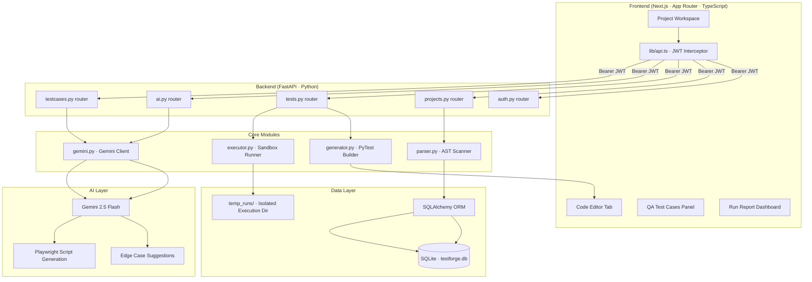
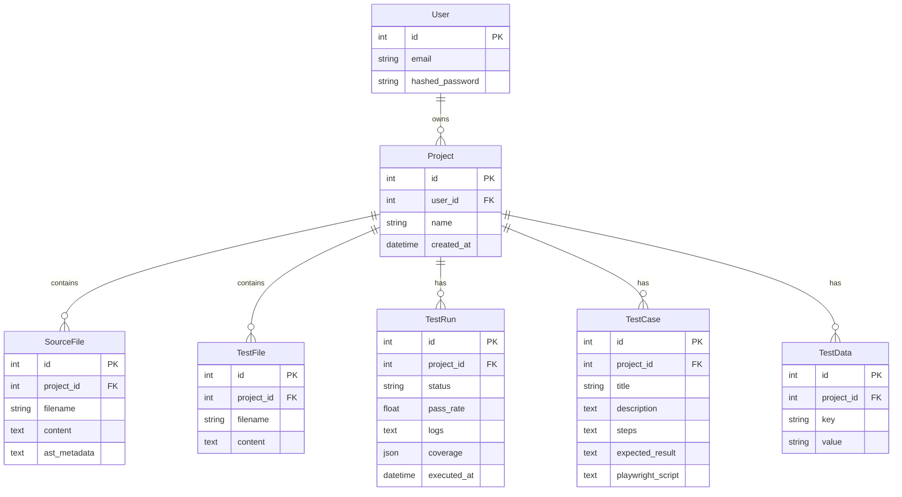

<div align="center">

<br />

```
 ████████╗███████╗███████╗████████╗███████╗ ██████╗ ██████╗  ██████╗ ███████╗     █████╗ ██╗
    ██╔══╝██╔════╝██╔════╝╚══██╔══╝██╔════╝██╔═══██╗██╔══██╗██╔════╝ ██╔════╝    ██╔══██╗██║
    ██║   █████╗  ███████╗   ██║   █████╗  ██║   ██║██████╔╝██║  ███╗█████╗      ███████║██║
    ██║   ██╔══╝  ╚════██║   ██║   ██╔══╝  ██║   ██║██╔══██╗██║   ██║██╔══╝      ██╔══██║██║
    ██║   ███████╗███████║   ██║   ██║     ╚██████╔╝██║  ██║╚██████╔╝███████╗    ██║  ██║██║
    ╚═╝   ╚══════╝╚══════╝   ╚═╝   ╚═╝      ╚═════╝ ╚═╝  ╚═╝ ╚═════╝ ╚══════╝    ╚═╝  ╚═╝╚═╝
```

**Intelligent Test Automation & QA Platform**

*AST parsing · AI edge cases · Playwright generation · All in one pipeline.*

<br />

[](https://nextjs.org)
[](https://fastapi.tiangolo.com)
[](https://www.sqlalchemy.org)
[](https://ai.google.dev)
[](https://playwright.dev)
[](https://pytest.org)
[](https://typescriptlang.org)
[](./LICENSE)

<br />

[Overview](#-overview) · [Architecture](#-architecture) · [Features](#-features) · [Getting Started](#-getting-started) · [API Reference](#-api-reference) · [AI Engine](#-ai-engine) · [Environment Variables](#-environment-variables)

<br />

</div>

---

## 📌 Overview

**TestForge AI** is a full-stack test automation platform that eliminates the manual overhead of test authoring across the entire software delivery pipeline. It parses Python source code via native AST analysis, auto-generates PyTest boilerplate, recommends AI-powered edge cases using Gemini, and translates manual QA test cases written in plain English into executable Playwright browser scripts — all from a single unified workspace.

| Persona | What TestForge AI Does For You |
|---|---|
| **Developer** | Scan uploaded Python files with AST, auto-generate PyTest templates, get AI-suggested boundary assertions, run tests in an isolated sandbox with line coverage |
| **QA / Tester** | Import/export CSV test suites, manage externalized test variables, generate Playwright scripts from manual step descriptions with one click |
| **Release Manager** | Centralized execution dashboard with pass/fail stats, per-file coverage percentages, and full stdout/stderr execution logs |

---

## 🏗 Architecture

### System Overview



### Repository Structure

```
TestForge-Antigravity/
├── backend/                         # FastAPI Python backend
│   ├── app/
│   │   ├── routers/
│   │   │   ├── auth.py              # JWT auth endpoints
│   │   │   ├── projects.py          # Project management & Python file upload
│   │   │   ├── tests.py             # Unit test generation & sandbox execution
│   │   │   ├── ai.py                # Gemini edge case suggestions
│   │   │   └── testcases.py         # CSV import/export, Playwright gen, variables
│   │   ├── auth.py                  # Password hashing & JWT utilities
│   │   ├── database.py              # SQLAlchemy engine & session factory
│   │   ├── executor.py              # Sandbox PyTest + Coverage.py runner
│   │   ├── gemini.py                # Gemini API client config
│   │   ├── generator.py             # AST-driven PyTest template builder
│   │   ├── models.py                # SQLAlchemy models (SQLite)
│   │   ├── parser.py                # AST scan logic
│   │   ├── schemas.py               # Pydantic request/response schemas
│   │   └── main.py                  # FastAPI app + CORS config
│   ├── .env                         # Environment variables
│   ├── requirements.txt             # Python dependencies
│   └── testforge.db                 # SQLite database
│
├── frontend/                        # Next.js App Router frontend
│   ├── src/
│   │   ├── app/
│   │   │   ├── login/               # Login page
│   │   │   ├── register/            # Registration page
│   │   │   ├── projects/
│   │   │   │   └── [id]/            # Project workspace
│   │   │   │       └── runs/
│   │   │   │           └── [run_id]/ # Test run report
│   │   │   ├── page.tsx             # Main dashboard / project list
│   │   │   ├── layout.tsx           # Global layout
│   │   │   └── globals.css          # Dark mode Tailwind classes
│   │   └── lib/
│   │       └── api.ts               # Fetch client with JWT header interceptor
│   ├── package.json
│   └── tsconfig.json
│
└── bank_account.py                  # Sample Python file for testing the platform
```

---

## ✨ Features

<details>
<summary><strong>🔬 AST-Based Code Analysis</strong></summary>

When a Python source file is uploaded, `parser.py` scans it using Python's native `ast` module — no code execution required. It extracts:

- Class definitions and methods
- Function arguments, type annotations, and default values
- Docstrings and line numbers

Results are displayed as an interactive tree in the project sidebar, forming the basis for template generation and AI analysis.

</details>

<details>
<summary><strong>⚡ Auto-Generated PyTest Templates</strong></summary>

`generator.py` uses the parsed AST metadata to build a complete PyTest file, handling:

- Constructor parameter mapping
- Async function support
- Class instance fixtures
- Stub assertions for all discovered methods

The generated template appears directly in the in-browser code editor and is fully editable before saving or executing.

</details>

<details>
<summary><strong>🤖 Gemini-Powered Edge Case Suggestions</strong></summary>

Clicking any class or function in the AST tree sends a prompt to **Gemini 2.5 Flash** via `ai.py`. The model returns 3–5 targeted boundary and edge case assertions covering:

- Empty and `None` inputs
- Overflow and underflow conditions
- Invalid type inputs
- Exception and error path assertions

Each suggestion includes ready-to-paste `pytest` code. A single `+` click injects it directly into the active test template.

</details>

<details>
<summary><strong>🧪 Isolated PyTest Sandbox Execution</strong></summary>

`executor.py` orchestrates a secure, isolated test run:

1. All project source and test files are written to a temporary directory (`backend/temp_runs/`)
2. `pytest --cov` is invoked using the virtual environment interpreter
3. JUnit XML and JSON reports are parsed and persisted to the database
4. The run report dashboard returns:
   - Overall PASSED / FAILED status
   - Pass rate fraction
   - Per-file line coverage percentages and missing lines
   - Full `stdout` / `stderr` execution logs

</details>

<details>
<summary><strong>📋 CSV Test Case Import / Export</strong></summary>

QA teams can import existing test suites via CSV with columns:

| Column | Description |
|---|---|
| `title` | Short name for the test case |
| `description` | What the test validates |
| `steps` | Step-by-step instructions (plain English) |
| `expected_result` | Expected outcome |

Test suites can be exported back to CSV at any time for sharing with stakeholders or version control.

</details>

<details>
<summary><strong>🌐 Playwright Script Generation with Externalized Variables</strong></summary>

The **Externalized Test Data** panel stores named environment variables (e.g. `BASE_URL`, `ADMIN_EMAIL`, `TEST_PASSWORD`). Clicking **Automate 🪄** on any manual test case sends the steps and all defined variables to Gemini, which returns a fully functional Playwright browser automation script — parameterized so the same script runs across Dev, Staging, and Production environments without modification.

</details>

---

## 🚀 Getting Started

### Prerequisites

| Tool | Version |
|---|---|
| Python | ≥ 3.10 |
| Node.js | ≥ 18.x |
| npm | ≥ 9 |

---

### Backend Setup (FastAPI)

```bash
# 1. Navigate to the backend directory
cd backend

# 2. Create a virtual environment
python -m venv .venv

# 3. Activate the virtual environment

# Windows (PowerShell)
.venv\Scripts\Activate.ps1

# Windows (CMD)
.venv\Scripts\activate.bat

# macOS / Linux
source .venv/bin/activate

# 4. Install dependencies
pip install -r requirements.txt
```

**Configure environment variables** — create `backend/.env`:

```env
SECRET_KEY=YOUR_SUPER_SECRET_JWT_KEY_HEX
ACCESS_TOKEN_EXPIRE_MINUTES=1440
GEMINI_API_KEY=YOUR_GEMINI_API_KEY
```

```bash
# 5. Start the FastAPI server
python -m uvicorn app.main:app --reload --host 127.0.0.1 --port 8000
```

The API is available at `http://127.0.0.1:8000`.  
Interactive Swagger docs: `http://127.0.0.1:8000/docs`.

---

### Frontend Setup (Next.js)

```bash
# 1. Navigate to the frontend directory
cd frontend

# 2. Install dependencies
npm install

# 3. Start the development server
npm run dev
```

Open `http://localhost:3000` in your browser.

---

### Quick Smoke Test

To verify the full stack is running end-to-end:

1. Register an account at `http://localhost:3000/register`
2. Create a new project from the dashboard
3. Upload `bank_account.py` (included in the repo root) as a sample source file
4. Observe the AST tree populate in the sidebar
5. Click **Generate Tests** → open the code editor to view the auto-generated PyTest template
6. Click any class method → trigger an AI edge case suggestion from Gemini
7. Click **Execute PyTest Suite** → view the run report dashboard with coverage breakdown

---

## 📡 API Reference

All routes are prefixed with `/api`. Protected routes require `Authorization: Bearer <token>`.

<details>
<summary><strong>Auth</strong> <code>/api/auth</code></summary>

| Method | Path | Description |
|---|---|---|
| `POST` | `/register` | Register a new user |
| `POST` | `/login` | OAuth2 form-based login, returns JWT |
| `POST` | `/login/json` | JSON payload login |
| `GET` | `/me` | Get current authenticated user profile |

</details>

<details>
<summary><strong>Projects</strong> <code>/api/projects</code></summary>

| Method | Path | Description |
|---|---|---|
| `POST` | `/` | Create a new workspace project |
| `GET` | `/` | List all projects for the authenticated user |
| `GET` | `/{project_id}` | Fetch project details |
| `DELETE` | `/{project_id}` | Delete a project |
| `POST` | `/{project_id}/upload` | Upload a Python source file — triggers AST parse and storage |
| `GET` | `/{project_id}/files` | List all files in a project |
| `GET` | `/{project_id}/files/{file_id}/content` | Read raw source file contents |

</details>

<details>
<summary><strong>Tests</strong> <code>/api/tests</code></summary>

| Method | Path | Description |
|---|---|---|
| `GET` | `/{project_id}/generate` | Generate PyTest template from AST metadata |
| `POST` | `/{project_id}/save` | Save test file to database |
| `GET` | `/{project_id}/generated` | List saved test files |
| `POST` | `/{project_id}/run` | Execute tests in isolated sandbox, returns run report |
| `GET` | `/{project_id}/runs` | List all execution run history |
| `GET` | `/{project_id}/runs/{run_id}` | Fetch detailed test execution and coverage report |

</details>

<details>
<summary><strong>AI</strong> <code>/api/ai</code></summary>

| Description |
|---|
| Endpoints for Gemini-powered edge case suggestions against AST-parsed classes and functions (routes defined in `ai.py`) |

</details>

<details>
<summary><strong>QA / Test Cases</strong> <code>/api/testcases</code></summary>

| Method | Path | Description |
|---|---|---|
| `GET` | `/{project_id}` | List all test cases for a project |
| `POST` | `/{project_id}` | Add a manual test case |
| `DELETE` | `/{project_id}/{testcase_id}` | Delete a test case |
| `POST` | `/{project_id}/import` | Import test cases from a CSV file |
| `GET` | `/{project_id}/export` | Export all test cases as a downloadable CSV |
| `POST` | `/{project_id}/generate-automation/{testcase_id}` | Translate manual steps into a Playwright script via Gemini |
| `GET` | `/{project_id}/testdata` | List externalized test variables |
| `POST` | `/{project_id}/testdata` | Create or update a variable |
| `DELETE` | `/{project_id}/testdata/{data_id}` | Delete a variable |

</details>

---

## 🤖 AI Engine

TestForge AI uses **Google Gemini 2.5 Flash** for two distinct generation tasks, both routed through `gemini.py`.

### Edge Case Suggestion Flow

```
User selects AST node (class or function)
        │
        ▼
ai.py router → gemini.py → Gemini 2.5 Flash
        │
        ▼
Returns 3–5 pytest assertions covering:
  • Empty / None inputs
  • Boundary overflow / underflow
  • Invalid type inputs
  • Exception paths
        │
        ▼
User clicks [+] → assertion injected into editor
```

### Playwright Script Generation Flow

```
User clicks [Automate 🪄] on a manual test case
        │
        ▼
testcases.py router reads:
  • test case title, description, steps, expected_result
  • all externalized test variables (BASE_URL, ADMIN_EMAIL, etc.)
        │
        ▼
Prompt sent to Gemini 2.5 Flash via gemini.py
        │
        ▼
Returns complete Playwright browser script
parameterized with all externalized variables
→ runs on Dev / Staging / Production unchanged
```

---

## 🗃 Data Models

Canonical schema lives in `backend/app/models.py` (SQLAlchemy + SQLite).



---

## 🌐 Environment Variables

### Backend (`backend/.env`)

| Variable | Required | Description |
|---|---|---|
| `SECRET_KEY` | ✅ | Hex secret for JWT signing |
| `ACCESS_TOKEN_EXPIRE_MINUTES` | ✅ | JWT expiry in minutes (e.g. `1440` = 24 h) |
| `GEMINI_API_KEY` | ✅ | Google Gemini API key for edge case and Playwright generation |

### Frontend

The API client in `frontend/src/lib/api.ts` targets `http://127.0.0.1:8000` by default. Update the base URL there to point at a different host for staging or production deployments.

---

## 🧰 Technology Stack

| Layer | Technology | Role |
|---|---|---|
| **Frontend** | Next.js (App Router), TypeScript, Tailwind CSS, Lucide Icons | UI, dark-mode design system, type-safe components |
| **Backend** | FastAPI (Python) | Async REST API, auto-generated Swagger docs at `/docs` |
| **Database** | SQLAlchemy ORM + SQLite | Relational storage for users, projects, test cases, runs, variables |
| **Parsing** | Python `ast` module | Native AST scan — no execution of untrusted code |
| **AI Copilot** | Google Gemini 2.5 Flash | Edge case suggestions and Playwright script generation |
| **Unit Testing** | PyTest + Coverage.py | Sandboxed execution with JUnit XML/JSON reports |
| **Browser Automation** | Playwright | Generated QA automation scripts |

---

## 🤝 Contributing

1. Fork the repository
2. Create a feature branch: `git checkout -b feat/your-feature`
3. Commit your changes: `git commit -m "feat: describe your change"`
4. Push to your fork: `git push origin feat/your-feature`
5. Open a Pull Request describing what changed and why

---

## 📄 License

MIT License — see [LICENSE](./LICENSE) for details.

---

<div align="center">

Built with ⚡ by the TestForge AI team

</div>